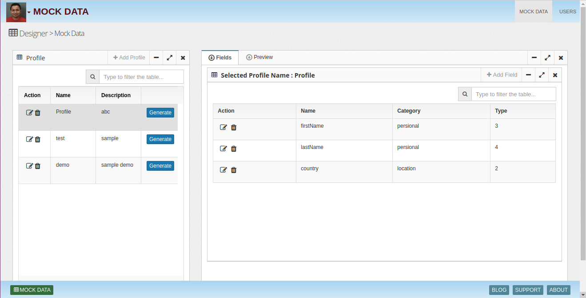
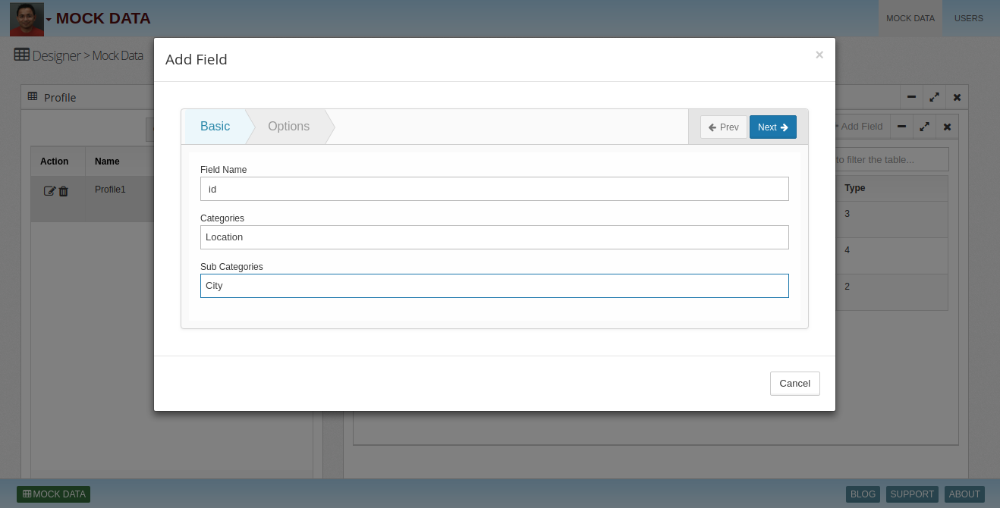
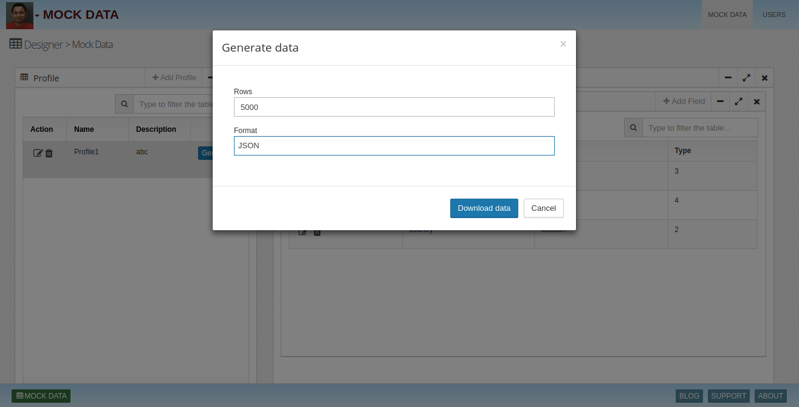
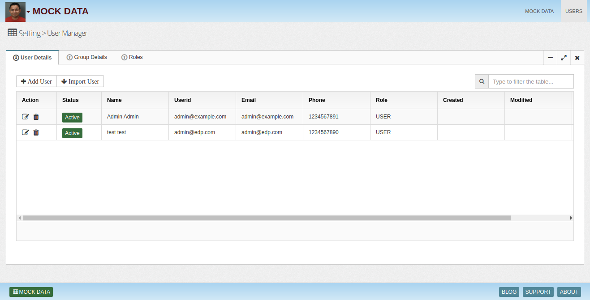
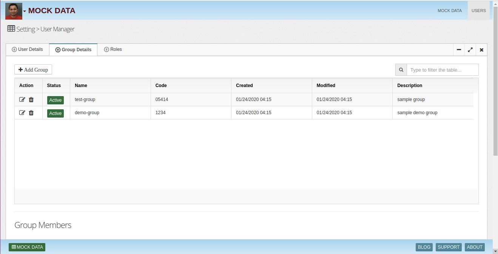

# Mock-Data-Generator
 ### Mock Data Generator ###



* Add Field



* Generate Data



### Users ###
* User Details



* Group Details




## Installation

## Steps
1. Go to bin and run install.sh
./install.sh
This will download mockdata.jar from S3 bucket in libs folder

2. Modify mock data profile yaml file in conf directory, example file is provided. This yaml file contains definitions of fields and number of records.

3. Run mockdata from bin to generate mock data
Options
format : csv | orc | avro | parquet
type   : local | bucket
target : local or bucket location
config : data profile yaml file

./mockdata --format csv --config ../conf/example.yaml --target /tmp/mydata --type local

./mockdata --format parquet --config ../conf/example.yaml --target "gs://mybucket/folder1" --type bucket

Installation using docker 
------
* Download or clone the repository. 
* cd /docker
* Run `docker-compose -f docker-compose.yaml up --build`
* Open browser with URL as http://localhost:8080/

## Example Config YAML File
```
tables:
- name: card_dim_c
  rows: 10
  columns:
  - name: card_id
    data_type: Int
    column_type: Sequential
    start: 0
    step: 1
  - name: card_code
    column_type: Expression
    expression: concat('0000000000', card_id)
  - name: hshd_id
    data_type: Int
    column_type: Sequential
    start: 0
    step: 1
  - name: hshd_code
    column_type: Expression
    expression: concat('0000000000', hshd_id)
  - name: prsn_id
    data_type: Int
    column_type: Sequential
    start: 0
    step: 1
  - name: prsn_code
    column_type: Expression
    expression: concat('0000000000', prsn_id)
  - name: hshd_isba_market_code
    column_type: Expression
    expression: concat('isba', hshd_code)

- name: transaction_item_fct_data
  rows: 100
  columns:
  - name: card_id
    data_type: Int
    column_type: Random
    min: 0
    max: 10
  - name: prod_id
    data_type: Int
    column_type: Random
    min: 0
    max: 1000
  - name: store_id
    data_type: Int
    column_type: Random
    min: 0
    max: 10
  - name: item_qty
    data_type: Int
    column_type: Random
    min: 0
    max: 10
  - name: item_cost
    data_type: Float
    column_type: Random
    min: 1
    max: 5
    decimal_places: 2
  - name: item_discount
    data_type: Float
    column_type: Random
    min: 1
    max: 2
    decimal_places: 2
  - name: spend_amt
    column_type: Expression
    expression: round((item_cost * item_discount) * item_qty, 2)
  - name: date_id
    data_type: Date
    column_type: Random
    min: 2017-01-01
    max: 2018-01-01
  partitions:
    - date_id

- name: card_dim_c_suppressions
  rows: 10
  columns:
  - name: identifier
    data_type: Int
    column_type: Random
    min: 0
    max: 10
  - name: identifier_type
    data_type: String
    column_type: Fixed
    value: card_id
```
